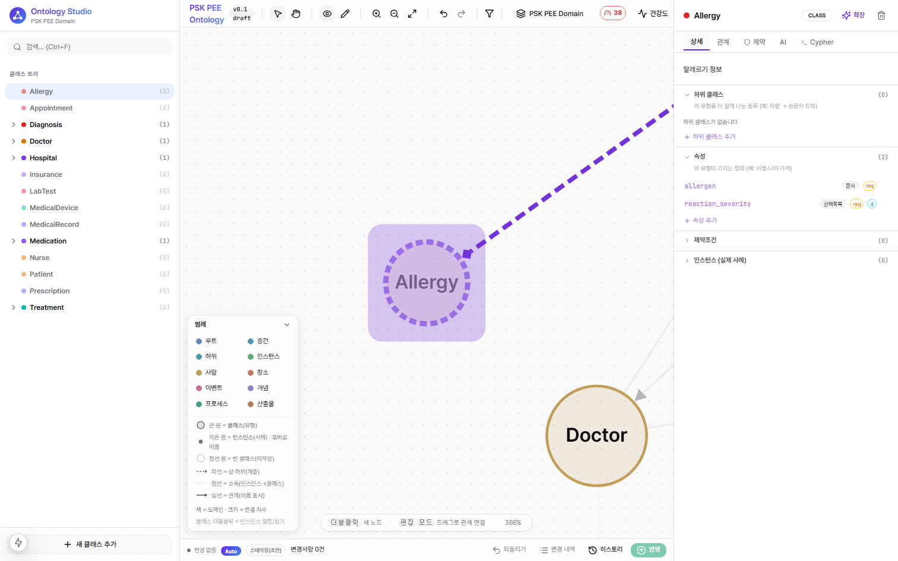

# 친절한 속성 패널

[← README](../../README.md) · 관련: [그래프 시각 언어](02-graph-visual-language.md) · [지식 입력](01-knowledge-input.md)

세부(서브클래스·속성·제약·인스턴스)는 패널에 숨어 있어 "결국 아무도 안 채우는" 문제가 컸습니다. 그래서 패널을 **안내·컨펌 중심의 친절한 한국어 UI**로 바꿨습니다.

## 진입

- 캔버스에서 노드 클릭, 또는 좌측 **탐색기 트리**에서 클릭 → 우측 패널이 해당 노드로 교체

## 섹션 (모두 한국어 + 한 줄 설명)

| 섹션 | 설명 |
|------|------|
| **하위 클래스** | 이 유형을 더 좁게 나눈 종류 (예: 차량 → 승용차·트럭) |
| **속성** | 이 유형이 가지는 항목 (예: 이름·나이·가격) + 데이터 타입 배지 |
| **제약조건** | 이 유형이 지켜야 하는 규칙 |
| **인스턴스 (실제 사례)** | 이 유형의 구체적 개체들 |
| **속성 값** | (인스턴스일 때) 각 속성의 실제 값 |
| **관계** | 다른 노드와의 연결 |

각 섹션 제목 옆에는 무엇을 적는 칸인지 한 줄 안내가 붙어, 용어를 몰라도 채울 수 있습니다.

## 데이터 타입 — 한국어 배지

속성의 자료형을 사람이 읽는 말로 표시합니다.

| 내부 타입 | 배지 |
|-----------|------|
| string | 문자 |
| integer | 정수 |
| float | 소수 |
| boolean | 예/아니오 |
| date | 날짜 |
| enum | 선택목록 |

## 상속

부모 클래스에서 내려온 속성은 **"{상위}에서 상속된 속성"**으로 구분 표시되어, 직접 정의한 것과 물려받은 것을 헷갈리지 않습니다.

## 빈 클래스 신호

세부가 비어 있는 클래스는 그래프에서 **점선 원**으로 보이므로([시각 언어](02-graph-visual-language.md)), 패널을 열기 전에도 "여긴 아직 채울 게 있다"가 한눈에 드러납니다.
