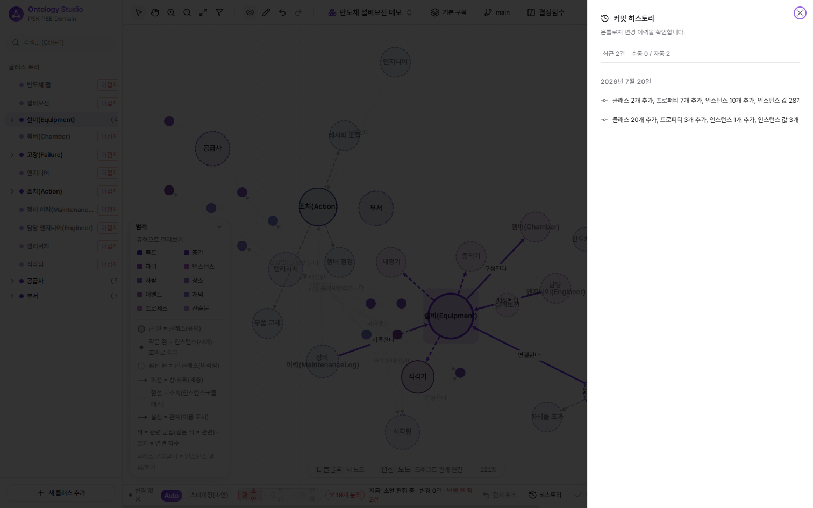

# 온톨로지 Git · 브랜치 · 인증

[← README](../../README.md) · 관련: [AI Critic·거버넌스](05-ai-critic-governance.md) · [문제해결 플랫폼](07-problem-solving-platform.md)

지식 그래프를 **버전 관리되는 자산**으로 다루는 "온톨로지의 Git" 흐름과, 그 위에 깔린 인증·보안입니다.

## 편집 → 스테이징 (자동 저장)

캔버스/패널의 모든 변경은 잠시 후 자동으로 Supabase에 저장됩니다. 별도 "저장" 버튼 없이 working directory처럼 동작합니다.

- 하단 **커밋 바**에 변경사항이 실시간 누적(추가/수정/삭제 건수)
- **되돌리기/다시하기** (Ctrl+Z / Ctrl+Shift+Z) — 컴파운드 액션 단위로 최대 50단계
- **변경 내역** — 추가(초록)/수정(amber)/삭제(빨강) diff 뷰

## 커밋 (스냅샷)

의미 있는 시점에 **커밋**하면 롤백 가능한 스냅샷이 생성됩니다. 이후 어느 커밋으로든 되돌릴 수 있습니다(`git commit` 비유). 하단 바의 **히스토리**에서 수동/자동 커밋 이력을 확인합니다.

## 브랜치 · 병합 (GitFlow)

`main` 외에 **브랜치**를 만들어 격리된 작업 공간에서 편집하고, 검증 후 **병합(MR)**으로 main에 반영합니다.

- 툴바의 **브랜치 선택기**로 현재 브랜치를 전환합니다. 브랜치는 스냅샷 체인으로 관리됩니다.
- 병합은 **3-way**로 동작하며, 충돌은 **내 것(mine) / 상대 것(theirs)**을 골라 해소합니다.
- **푸시(Neo4j 발행)는 `main` 전용**입니다 — 격리 브랜치의 미검증 변경이 프로덕션으로 새지 않도록 게이팅합니다.

## 스테이징 바 (초안 → 확정 → 발행)

하단 바는 현재 상태를 평문으로 보여줍니다.

- **초안(스테이징)** — 편집 중인 변경이 Supabase에 쌓인 상태. `변경 N건 · 발행 안 됨 M건`처럼 실시간 집계.
- **자동 저장(Auto)** — 기본 켜짐. "모두 저장됨" ↔ "지금 저장"으로 상태 표시.
- **발행** — 검증된 변경을 Neo4j로 내보냅니다(자동 발행 아님 — 직접 눌러야 반영). `발행 (미발행 N)`으로 대기 건수 표시.

## 푸시 (프로덕션 반영)

커밋된 변경을 **Neo4j 프로덕션 그래프**에 반영합니다.

1. 커밋 바 **Neo4j 푸시**
2. 확인 시트 — 변경 요약 + **Cypher 미리보기**(구문 하이라이트·복사)
3. 푸시 실행 → 진행률 + 단계별 체크리스트
4. 완료 시 성공/실패별 안내(실패는 재시도·건너뛰기)

푸시 진행 중에는 시트를 닫을 수 없습니다(Esc/바깥 클릭 차단). 검증된 변경만 프로덕션으로 나가도록 스테이징과 프로덕션을 분리한 설계입니다.

## 노드 삭제 — cascade vs promote

하위 항목이 있는 노드를 지우면 영향 범위 트리가 뜨고, **하위 모두 삭제(cascade)** 또는 **하위를 상위로 승격(promote)** 중 선택합니다. 삭제 후에도 Undo로 복구됩니다.

## 인증 · 보안

- **Supabase Auth** — 로그인/회원가입/비밀번호 재설정, SSR 세션(미들웨어가 `getUser()`로 검증·갱신). 미인증 접근은 로그인으로 게이팅됩니다.
- **RLS 락다운** — 데이터 테이블은 기본 deny-all. 앱 서버는 service-role로 동작하며 사용자별 authz는 별도 스코프입니다. `/api/*`는 미들웨어 게이팅에서 제외(서버 측 service-role 동작).
- **출처(Provenance)** — 노드·관계·제약에 근거·출처유형·confidence를 기록해 신뢰 추적 가능.

## 키보드 단축키

| 단축키 | 동작 |
|--------|------|
| `Ctrl+Z` / `Ctrl+Shift+Z` | 되돌리기 / 다시하기 |
| `Delete` | 선택 노드·엣지 삭제 |
| `Ctrl+F` | 탐색기 검색 포커스 |
| `Esc` | 팝오버 닫기 / 선택 해제 |
| 더블클릭(빈 공간) | 새 노드 팝오버 |
| 클래스 더블클릭 | 인스턴스 펼침/접기 |
