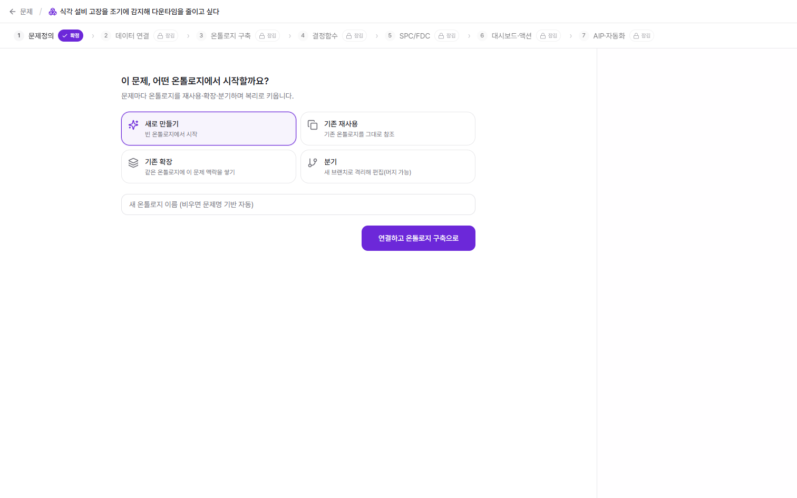
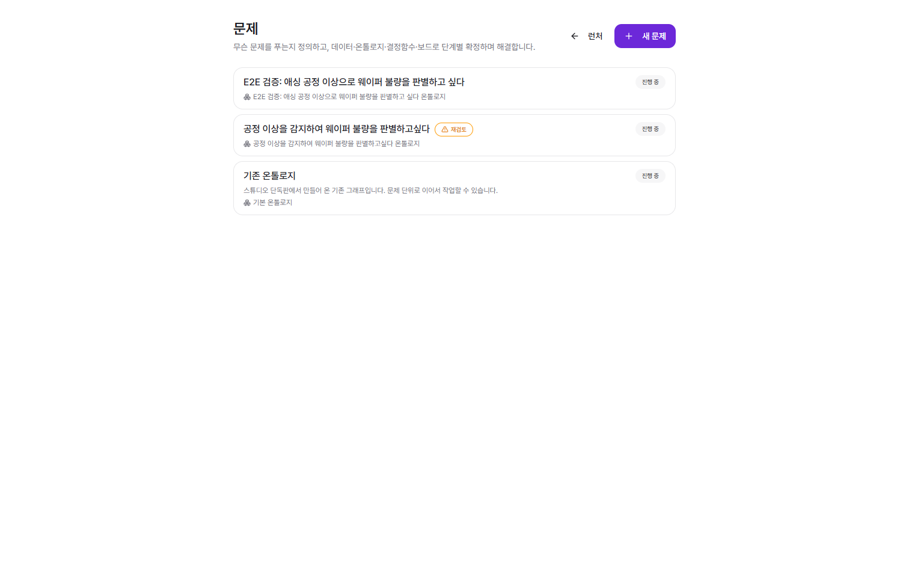
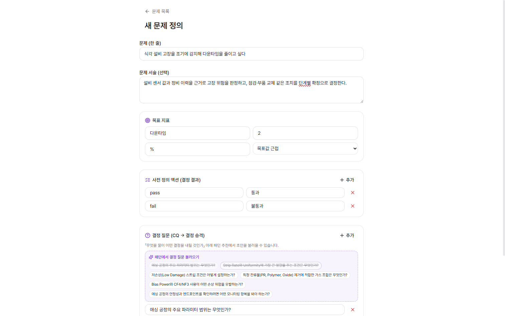
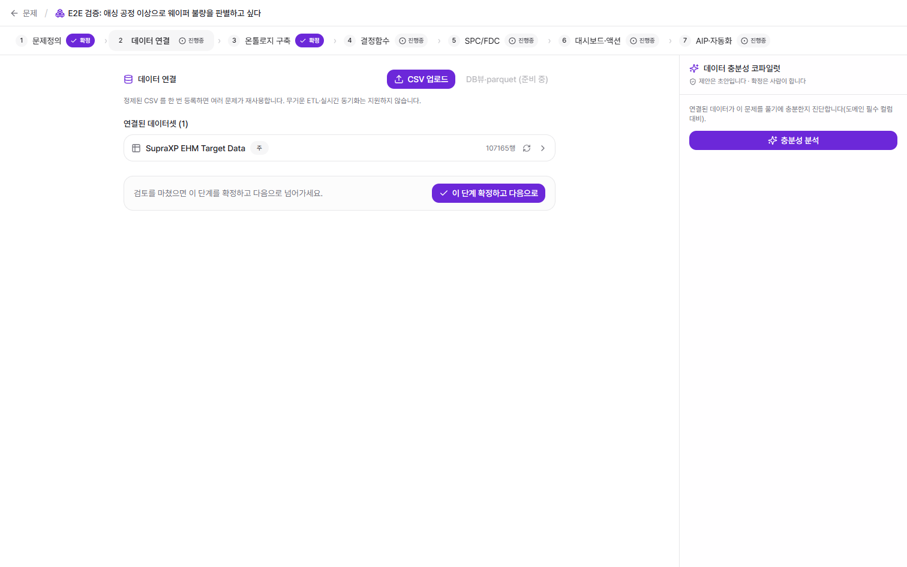
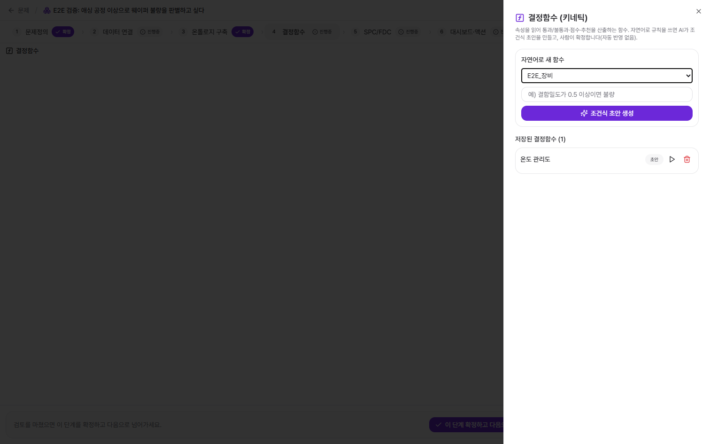
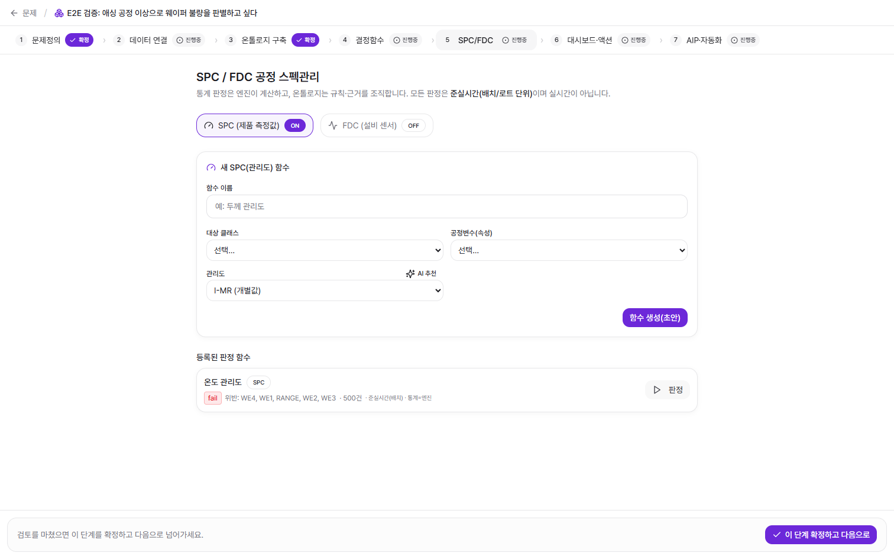
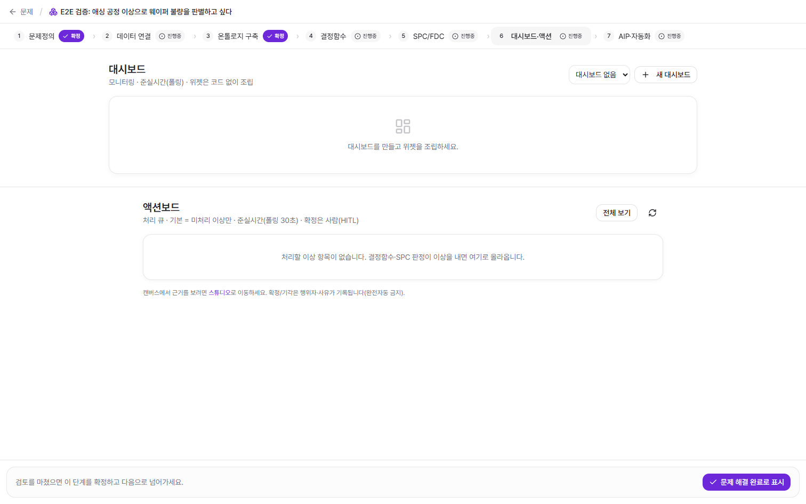
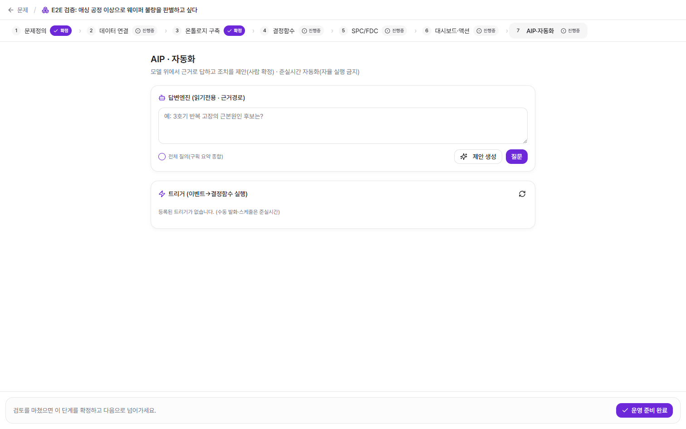

# 문제해결 플랫폼 (7단계 워크플로우)

[← README](../../README.md) · 관련: [온톨로지 Git](06-staging-commit-push.md) · [패턴 마켓플레이스](08-marketplace-patterns.md)

온톨로지를 "그리는" 데서 멈추지 않고, 그 모델 위에서 **실제 문제를 정의하고 해결**하는 층입니다. 랜딩(`/`) → 런처(`/platform`)에서 **문제해결 플랫폼**을 고르면 진입합니다.

## 두 개의 진입점

같은 온톨로지 엔진 위에 두 개의 사용 방식이 있습니다.

- **온톨로지 스튜디오** (`/studio`) — 절차 없이 바로 그래프를 스케치.
- **문제해결 플랫폼** (`/problems`) — 문제 단위로 데이터·온톨로지·결정·보드를 단계별 확정.

플랫폼에서 만든 온톨로지는 스튜디오와 공유되며, 다음 문제에서 **재사용·확장·분기**로 복리처럼 커집니다.

`/problems`는 진행 중인 문제 목록입니다. 각 카드는 문제·연결된 온톨로지·상태(진행 중/재검토 등)를 보여주고, `새 문제`로 새 워크플로우를 시작합니다.

## 격리 게이팅 (단계 잠금)

7단계는 한 줄로 이어지되, **각 단계를 사람이 확정해야 다음이 열립니다.** 확정 전 단계는 `잠김`으로 표시되고, 확정된 단계는 `확정`, 작업 중은 `진행중`입니다. 상단 스텝퍼에서 상태가 한눈에 보입니다.

## 단계별 상세

### 1. 문제정의 (`/problems/[id]/define`)

- **한 줄 문제** + 선택적 서술
- **목표 지표** — 지표명·목표값·단위·방향(낮을수록/높을수록/목표값 근접)
- **사전 정의 액션** — 결정 결과(예: `pass`/통과, `fail`/불통과)
- **결정 질문(CQ)** — "무엇을 물어 어떤 결정을 내릴 것인가". 연결된 패턴에서 **CQ 초안을 불러올 수 있습니다.**

### 2. 데이터 연결 (`/problems/[id]/data`)

- 정제된 **CSV를 한 번 등록**하면 여러 문제가 재사용합니다(무거운 ETL·실시간 동기화는 비대상).
- **데이터 충분성 코파일럿** — 연결된 데이터가 이 문제를 풀기에 충분한지, 도메인 필수 컬럼 대비 진단(제안은 초안, 확정은 사람).

### 3. 온톨로지 구축 (`/problems/[id]/ontology-link` → `/studio`)

- 온톨로지를 **새로 만들기 · 기존 재사용 · 기존 확장 · 분기(브랜치)** 중 선택해 연결.
- 연결 후에는 스튜디오 엔진(지식 입력·CSV·AI Critic)으로 구축합니다 → [지식 입력](01-knowledge-input.md).

### 4. 결정함수 (`/problems/[id]/functions`)

- 속성을 읽어 **통과/불통과·점수·추천**을 산출하는 함수.
- **자연어로 규칙**을 쓰면 AI가 **조건식 초안**을 만들고, 사람이 확정합니다(자동 반영 없음).
- **키네틱 코파일럿**이 문제 유형에 맞는 템플릿(SPC/FDC/정비/출하)을 추천하고, 라이브러리 밖이면 정직하게 "직접 작성"으로 안내합니다.

### 5. SPC/FDC (`/problems/[id]/spc`)

- **SPC(제품 측정값)** · **FDC(설비 센서)** 토글.
- 대상 클래스·공정변수(속성)·관리도 유형(**I-MR** 개별값 / **X-bar/R** 부분군)을 골라 판정 함수를 만듭니다(AI 추천 가능).
- **통계 판정은 엔진이 계산**하고, 온톨로지는 규칙·근거를 조직합니다. 판정 결과는 **Western Electric 규칙**(WE1~4·RANGE) 위반으로 표기되며, 모든 판정은 **준실시간(배치/로트 단위)**입니다.

### 6. 대시보드·액션 (`/problems/[id]/board`)

- **대시보드** — 위젯을 코드 없이 조립(ECharts), 준실시간 폴링.
- **액션보드** — 결정함수·SPC 판정이 낸 **이상 항목의 처리 큐**. 기본은 미처리 이상만, 폴링 30초.
- **확정/기각은 사람(HITL)** — 행위자·사유가 기록되며 **완전자동은 금지**됩니다.

### 7. AIP·자동화 (`/problems/[id]/operate`)

- **답변엔진(읽기전용·근거경로)** — 모델 위에서 **근거로만** 답하고 조치를 제안(사람 확정). 근거가 없으면 지어내지 않고 근거경로만 노출합니다.
- **전체 질의** — 구획 요약을 map-reduce로 종합.
- **트리거** — 이벤트 → 결정함수 실행. 수동 발화·스케줄은 준실시간이며 **자율 실행은 금지**됩니다.

## 관통하는 원칙

| 원칙 | 어떻게 |
|------|--------|
| **AI는 제안, 사람이 확정** | 모든 단계·함수·조치가 초안 → 사람 컨펌. 자동 반영/자율 실행 없음. |
| **온톨로지 재사용(복리)** | 문제마다 온톨로지를 재사용·확장·분기해 자산이 누적. |
| **근거 우선** | SPC/결정은 엔진이 계산, AIP는 근거경로로만 답변. |
| **준실시간** | 통계·보드·자동화는 배치/폴링 기반(실시간 제어 아님). |
