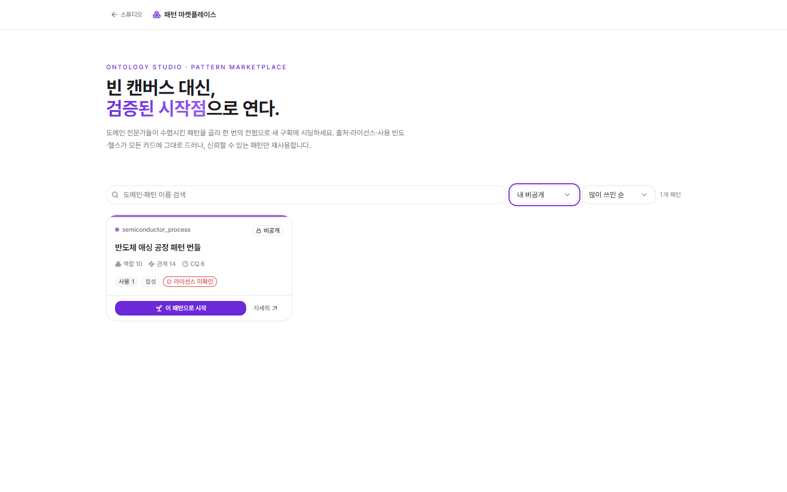

# 패턴 마켓플레이스 · 재사용 (구획 · 브릿지)

[← README](../../README.md) · 관련: [문제해결 플랫폼](07-problem-solving-platform.md) · [AI Critic·거버넌스](05-ai-critic-governance.md)

같은 도메인의 온톨로지를 매번 맨바닥부터 그리지 않도록, **검증된 설계(패턴)**를 재사용하고 도메인을 **구획(Partition)**으로 나눠 관리합니다. AI의 역할 전환(그림쟁이 → 수호자)이 실제 자산으로 축적되는 지점입니다.

## 패턴 마켓플레이스 (`/marketplace`)

> "빈 캔버스 대신, 검증된 시작점으로 연다."

- 도메인 전문가가 수렴시킨 패턴을 골라 **한 번의 컨펌으로 새 구획에 시딩**합니다.
- 각 카드는 **출처·라이선스·사용 빈도·헬스(역할 수·관계 수·CQ 수)**를 그대로 드러냅니다 — 신뢰할 수 있는 패턴만 재사용.
- 스코프 필터: **공유 카탈로그 · 조직 공유 · 공개 · 내 비공개**. (기본은 공유 카탈로그, 비공개는 기본 제외)
- 스튜디오 빈 상태의 "저장된 패턴으로 시작"·"패턴으로 시작"에서도 같은 카탈로그로 진입합니다.

## 학습형 패턴 캐시

패턴은 온톨로지 생성 시퀀스 ②단계(패턴 확보)의 산출물입니다.

1. **재사용** — 이미 배운 패턴(`patterns`)이 있으면 그대로 시딩.
2. **발견** — 없으면 공개 온톨로지를 검색 → 도메인에 **적응(adapt)** → 부족하면 **합성(synthesize)**.
3. **승격(수렴)** — 확정된 설계는 캐시로 승격되어, 다음 작업의 첫 그리기 시간(TTFG)이 점점 줄어듭니다.

발행 게이트에는 **사내 식별자 마스킹 · 라이선스 확인 · 헬스 임계**가 걸려, 검증되지 않은 패턴은 "검증 필요"로 표시됩니다.

## 구획 (Partition)

한 온톨로지 안에서 도메인을 **격리된 칸**으로 나눕니다(예: `설비보전`, `설비공급망`).

- 새 입력이 기존 구획과 일부만 겹치면, AI가 **"새 구획으로 분리"**를 제안합니다(현재 구획 유지도 선택 가능).
- 구획 단위로 질의·요약 범위를 좁힐 수 있습니다(스코프 질의).
- 툴바의 **구획 선택기**로 현재 작업 구획을 전환합니다.

## 크로스-구획 브릿지 (Bridge)

분야는 분리하되, 서로 다른 구획의 **같은 대상**은 연결합니다.

- AI가 `same_as` 유사도(예: 100% / 67%)와 **근거**를 붙여 브릿지 후보를 제안합니다("램리서치"와 "램리서치"가 서로 다른 구획에 100% 유사도로 등장 — 동일 대상 추정).
- 사람이 **연결 / 별개**를 확정합니다(자동 병합 없음).

이 제안들은 지식 입력·CSV 분석의 **미리보기(구조 검수)**에서 확정 전에 함께 노출됩니다 → [AI Critic·거버넌스](05-ai-critic-governance.md).

## 용어 해소 · 드리프트

- **도메인 용어사전(glossary)** — 사내 약어·모호어의 뜻을 사전 → 맥락 → 웹 순으로 확정하고 재주입해, 같은 용어가 온톨로지 전반에서 일관되게 쓰이도록 합니다.
- **드리프트 보정** — 임베딩/용어가 시간에 따라 흔들리면 감지·보정합니다.

> 재사용·구획·브릿지·용어는 "지속되는 하나의 모델을 수호·강화"하는 AI의 역할(축 3)을 실제 자산 축적으로 구현한 것입니다.
