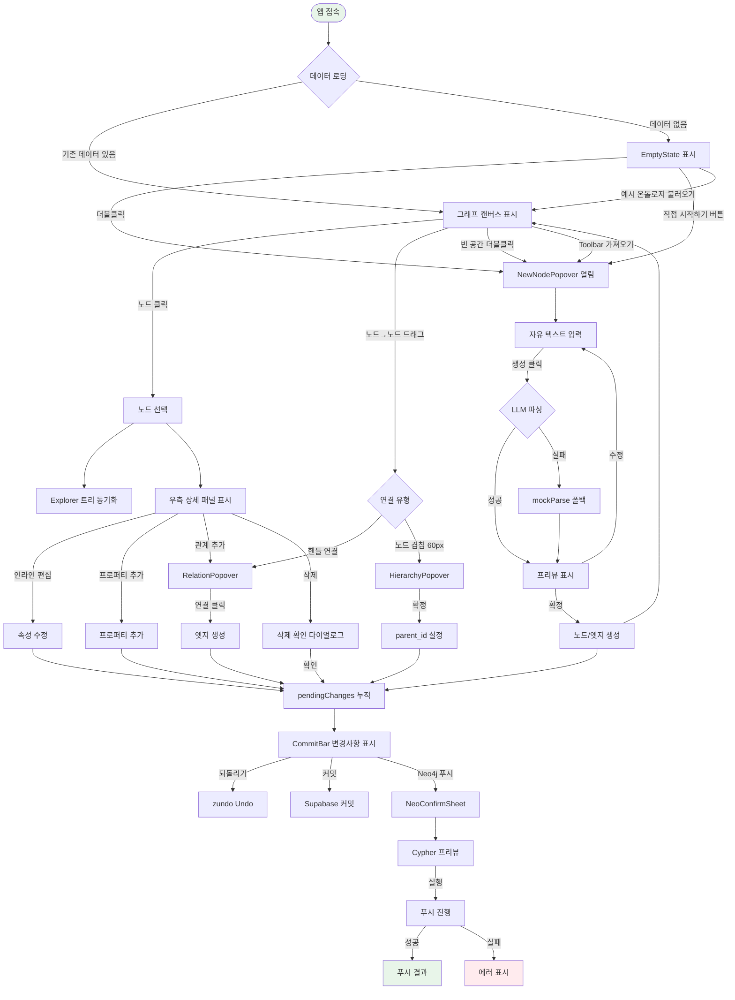
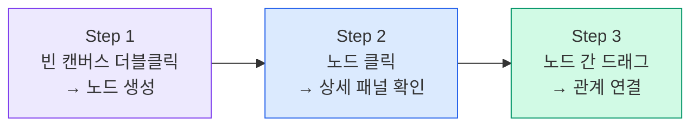
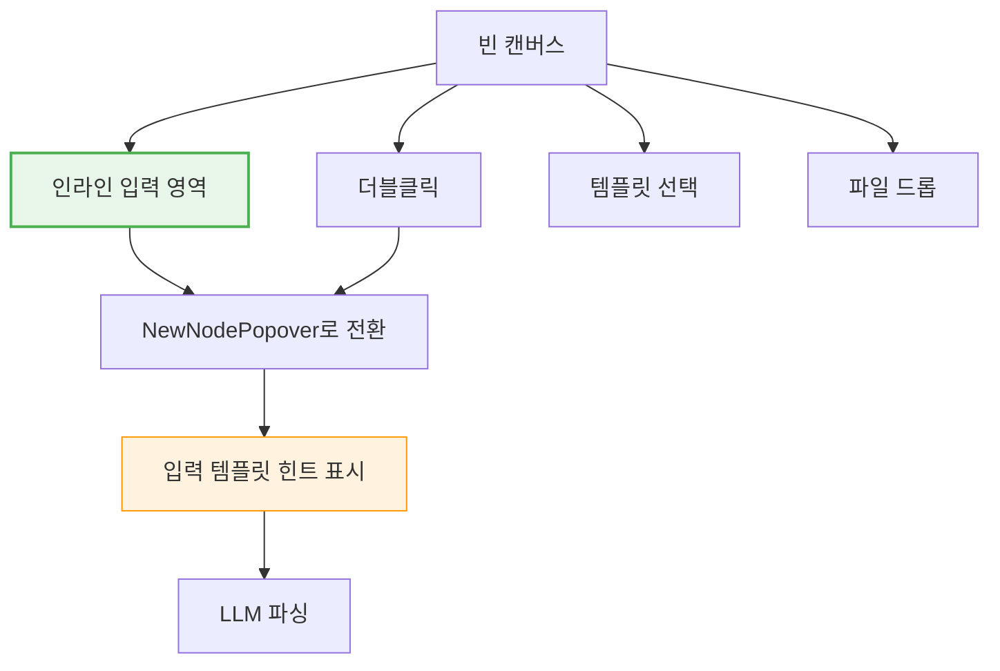
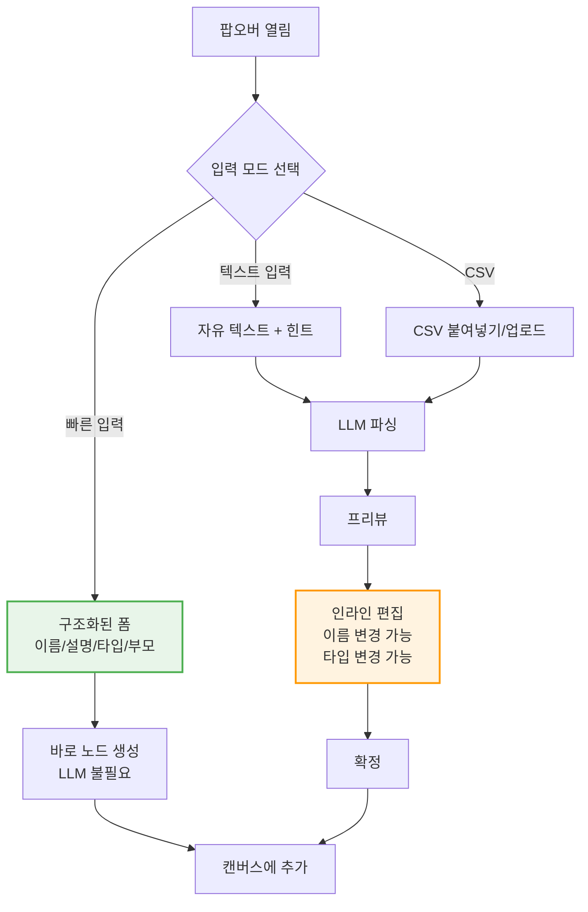
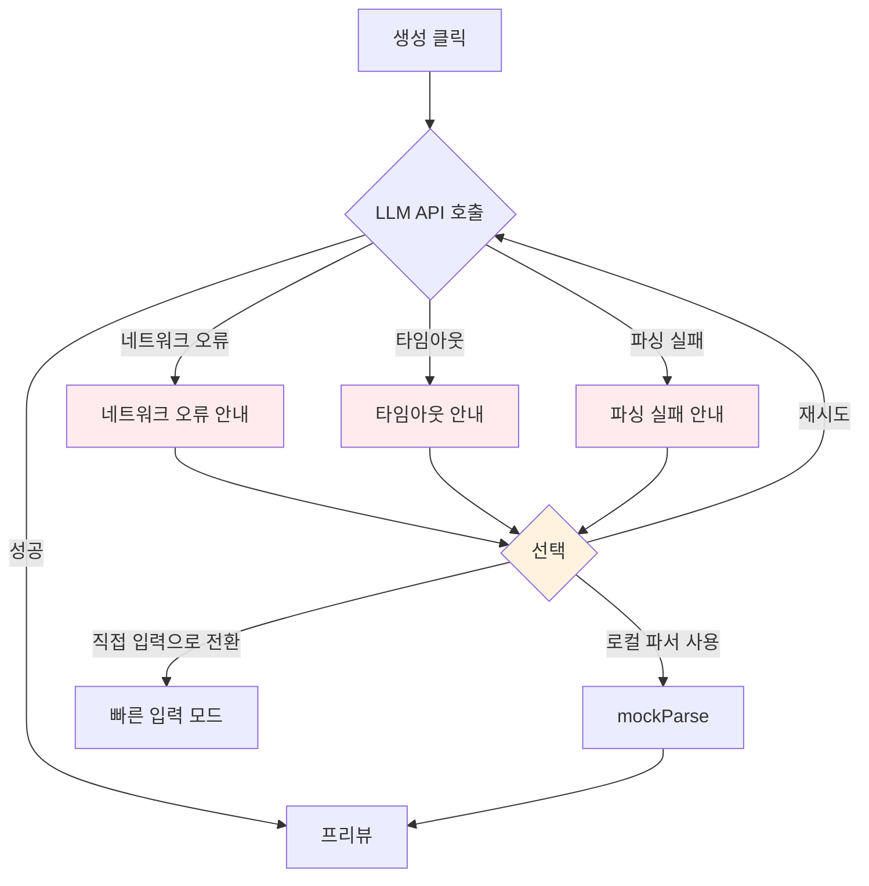
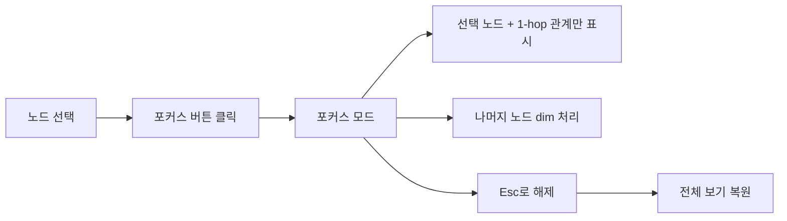
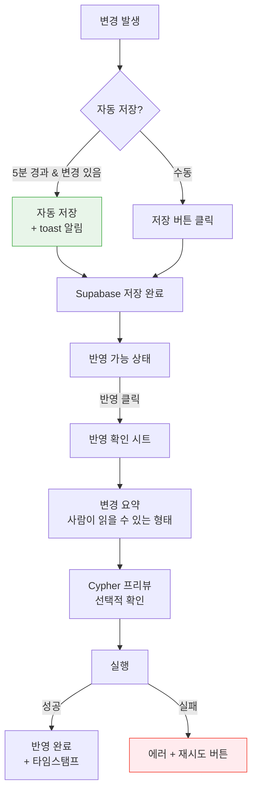
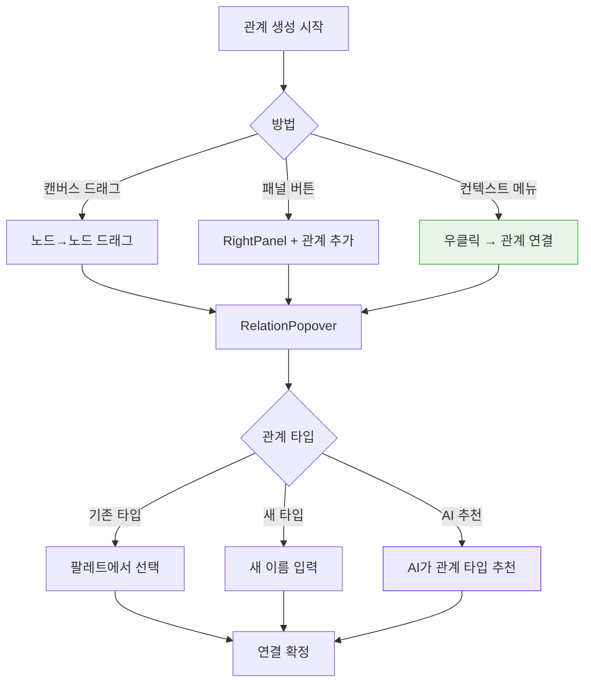

# UX 설계자 — 사용자 경험 분석 및 개선안

> **분석일**: 2026-03-22
> **분석 대상**: Ontology Studio MVP
> **분석자**: UX설계자 (v3 기획단)

---

## 1. 현재 사용자 여정 (As-Is)

### 1.1 머메이드 순서도 (전체 플로우)



### 1.2 단계별 상세 분석

#### Stage 1: 앱 접속 & 초기 로딩

| 항목 | 현재 상태 |
|------|----------|
| **진입점** | `/` 단일 페이지 (SPA) |
| **로딩 UX** | CanvasSkeleton + ExplorerSkeleton + RightPanelSkeleton |
| **데이터 로딩** | React Query → Zustand 동기화 (`useLoadOntology`) |
| **로딩 시간** | Supabase 네트워크 의존 (추정 0.5~2초) |

**인지 부하**: 낮음. 스켈레톤이 레이아웃을 예측 가능하게 유지.

#### Stage 2: 빈 캔버스 (첫 사용)

| 항목 | 현재 상태 |
|------|----------|
| **안내** | "빈 공간을 더블클릭하여 지식을 입력하세요" |
| **보조 액션** | 예시 온톨로지 불러오기 / 직접 시작하기 |
| **입력 예시** | 반도체 FAB 도메인 예시 텍스트 |
| **파일 드롭** | 드롭존 오버레이 있으나 실제 처리 미구현 |
| **키보드 힌트** | 하단에 `더블클릭`/`AI 자동 구조화` 표시 |

**인지 부하**: 중간. 더블클릭이라는 액션이 직관적이지 않을 수 있음.

#### Stage 3: 노드 생성 (NewNodePopover)

| 항목 | 현재 상태 |
|------|----------|
| **입력** | 자유 텍스트 textarea (120px 최소 높이) |
| **보조 버튼** | 파일 첨부, 붙여넣기 (UI만 있고 미구현) |
| **파싱** | LLM API → 실패 시 mockParse 폴백 |
| **로딩 UX** | 100자+ 시 5단계 프로그레스 (텍스트 파싱→엔티티 추출→관계 추론→매칭→최적화) |
| **프리뷰** | 계층 트리 + 프로퍼티 + 관계 목록, 개별 삭제 가능 |
| **확정** | 토폴로지 정렬 후 순차 생성 |

**인지 부하**: 높음. 사용자가 무엇을 입력해야 하는지, 결과가 어떻게 나올지 예측하기 어려움.

#### Stage 4: 그래프 탐색 & 편집

| 항목 | 현재 상태 |
|------|----------|
| **레이아웃** | ELKjs layered 자동 레이아웃 |
| **노드 선택** | 클릭 시 Explorer + RightPanel 동기화 |
| **멀티 선택** | 미지원 |
| **검색** | Explorer 패널 내 Ctrl+F 검색 |
| **필터링** | 이름 기반 필터만 가능 |
| **줌/패닝** | React Flow 기본 + Toolbar 버튼 + MiniMap |

**인지 부하**: 중간~높음. 100+ 노드 시 시각적 혼잡.

#### Stage 5: 관계 관리

| 항목 | 현재 상태 |
|------|----------|
| **생성 방법 1** | 노드 핸들에서 다른 노드로 드래그 → RelationPopover |
| **생성 방법 2** | RightPanel 관계 탭에서 [+관계 추가] |
| **관계 선택** | 기존 팔레트 라디오 + 새 이름 입력 |
| **시각 피드백** | smoothstep 엣지, 선택 시 primary 색상 |
| **삭제** | RightPanel 관계 탭에서 삭제 |

**인지 부하**: 중간. 드래그 연결은 직관적이지만 발견하기 어려움.

#### Stage 6: 커밋 & 푸시

| 항목 | 현재 상태 |
|------|----------|
| **변경 추적** | pendingChanges 배열, ADD/MOD/DEL 카운트 |
| **커밋** | 자동 메시지 생성 ("N added, N modified, N deleted") |
| **변경 내역** | 바텀 시트, 타임스탬프 + 테이블 + 이름 표시 |
| **Neo4j 푸시** | 커밋 → dry run → Cypher 프리뷰 → 실행 → 결과 |
| **롤백** | API 존재하나 UI 미구현 |
| **오류 복구** | toast 알림만, 재시도 메커니즘 없음 |

**인지 부하**: 높음. 커밋과 푸시의 차이, Cypher 프리뷰의 의미를 이해해야 함.

---

## 2. 핵심 Pain Points

### 우선순위별 정리

| # | Pain Point | 심각도 | 영향 범위 | 설명 |
|---|-----------|--------|----------|------|
| **P1** | 더블클릭 발견성 부족 | 높음 | 온보딩 | 첫 사용자가 "더블클릭"을 자연스럽게 시도하지 않음. 텍스트 안내가 있지만 능동적 발견이 어려움 |
| **P2** | LLM 입력의 불확실성 | 높음 | 노드 생성 | "자유 형식"이라는 안내가 오히려 사용자를 막막하게 만듦. 어떤 형식이 좋은 결과를 내는지 학습 곡선이 높음 |
| **P3** | 커밋/푸시 개념 혼란 | 높음 | 데이터 관리 | 도메인 전문가에게 Git 스타일 커밋/푸시는 낯선 개념. "저장"과 "반영"의 2단계가 왜 필요한지 직관적이지 않음 |
| **P4** | 대규모 그래프 탐색 한계 | 중간 | 그래프 탐색 | 100+ 노드에서 원하는 노드 찾기 어려움. 필터링이 이름 검색만 가능 |
| **P5** | 프리뷰에서 수정 제한 | 중간 | 노드 생성 | 프리뷰에서 항목 삭제만 가능. 이름 변경, 관계 수정, 프로퍼티 타입 변경 불가 |
| **P6** | 관계 생성 발견성 | 중간 | 관계 관리 | 드래그로 관계를 만드는 것을 발견하기 어려움. 노드 핸들이 시각적으로 두드러지지 않음 |
| **P7** | Undo 범위 불명확 | 중간 | 편집 | Undo가 어떤 범위까지 되돌리는지 사용자가 예측하기 어려움. 변경 이력과 Undo의 관계 불명확 |
| **P8** | 에러 복구 경로 부재 | 중간 | 전체 | LLM 실패, 커밋 실패, 푸시 실패 시 toast 알림 외 복구 가이드 없음 |
| **P9** | 미구현 기능의 UI 노출 | 낮음 | 전체 | 파일 첨부, 붙여넣기, 내보내기, AI 어시스턴트 버튼이 disabled 상태로 노출되어 혼란 유발 |
| **P10** | 접근성 부족 | 낮음 | 접근성 | 키보드만으로 전체 플로우 수행 불가. aria 속성 부분적. 스크린 리더 미지원 |

---

## 3. 개선안 (To-Be)

### 3.1 온보딩 개선

#### 3.1.1 가이드 투어 (Interactive Walkthrough)

첫 접속 시 3단계 가이드 오버레이:



**와이어프레임 — 가이드 Step 1:**

```
┌──────────────────────────────────────────────────────┐
│  ┌─────────────────────────────────────────────────┐ │
│  │                                                 │ │
│  │    ╔═══════════════════════════════╗             │ │
│  │    ║  Step 1/3                     ║             │ │
│  │    ║                               ║             │ │
│  │    ║  빈 공간을 더블클릭해 보세요    ║             │ │
│  │    ║                               ║             │ │
│  │    ║  자유 형식의 텍스트를 입력하면   ║             │ │
│  │    ║  AI가 자동으로 구조화합니다      ║             │ │
│  │    ║                               ║             │ │
│  │    ║  [건너뛰기]  [다음 →]          ║             │ │
│  │    ╚═══════════════════════════════╝             │ │
│  │            ↓ (화살표가 캔버스 영역을 가리킴)       │ │
│  │         · · · · · · · · · ·                     │ │
│  │         ·  (pulse 애니메이션) ·                   │ │
│  │         · · · · · · · · · ·                     │ │
│  │                                                 │ │
│  └─────────────────────────────────────────────────┘ │
│  [변경사항 0건]                          [커밋] [푸시] │
└──────────────────────────────────────────────────────┘
```

#### 3.1.2 EmptyState 개선 — CTA 버튼 강화

```
┌──────────── EmptyState (개선안) ──────────┐
│                                           │
│           [마우스 클릭 아이콘]              │
│                                           │
│    빈 공간을 더블클릭하여 시작하세요         │
│    또는 아래 방법 중 하나를 선택하세요       │
│                                           │
│  ┌─────────────┐  ┌─────────────┐        │
│  │  📝 텍스트   │  │  📄 파일    │        │
│  │  직접 입력   │  │  CSV/TXT    │        │
│  └─────────────┘  └─────────────┘        │
│  ┌─────────────┐  ┌─────────────┐        │
│  │  📋 템플릿   │  │  🔗 URL     │        │
│  │  예시 불러오기│  │  웹 데이터   │        │
│  └─────────────┘  └─────────────┘        │
│                                           │
│  ── 또는 ──                                │
│                                           │
│  ┌─────────────────────────────────────┐  │
│  │  여기에 텍스트를 입력하세요...        │  │
│  │  (인라인 입력 → 바로 LLM 파싱)       │  │
│  └─────────────────────────────────────┘  │
│                                           │
└───────────────────────────────────────────┘
```

**핵심 변경**: EmptyState 자체에 인라인 텍스트 입력 영역을 배치하여 팝오버를 열지 않아도 바로 입력 가능하게 함. "더블클릭"이라는 숨겨진 제스처 의존도를 낮춤.

#### 3.1.3 입력 가이드 개선



### 3.2 노드 생성 플로우 개선

#### 3.2.1 입력 가이드 템플릿

현재 "자유 형식으로 입력하세요"라는 안내는 너무 모호함. 개선안:

```
┌────── NewNodePopover (개선안) ──────┐
│                                     │
│  새 노드                    [×]     │
│  ─────────────────────────────────  │
│                                     │
│  [빠른 입력]  [텍스트 입력]  [CSV]   │
│                                     │
│  ── 빠른 입력 모드 ──                │
│  ┌─────────────────────────────┐   │
│  │  이름: [___________________]│   │
│  │  설명: [___________________]│   │
│  │  타입: (●)클래스  ( )인스턴스│   │
│  │  부모: [▼ 상위 클래스 선택 ]│   │
│  └─────────────────────────────┘   │
│                                     │
│  ── 텍스트 입력 모드 ──             │
│  ┌─────────────────────────────┐   │
│  │                             │   │
│  │  (자유 텍스트 입력)          │   │
│  │                             │   │
│  └─────────────────────────────┘   │
│  💡 이렇게 입력해 보세요:           │
│  · "DryAsher는 Equipment의 하위"   │
│  · "김철수 → 관리 → SUPRA"         │
│  · CSV 데이터 붙여넣기              │
│                                     │
│  [취소]                    [생성 →] │
└─────────────────────────────────────┘
```



**핵심 변경**:
1. **빠른 입력 모드 추가**: 단일 노드를 만들 때 LLM 없이 폼으로 바로 생성
2. **입력 힌트 강화**: 구체적인 예시를 상황에 맞게 제공
3. **프리뷰 인라인 편집**: 이름 클릭 시 수정 가능, 프로퍼티 타입 드롭다운

#### 3.2.2 프리뷰 단계 강화

```
┌────── 프리뷰 (개선안) ─────────────┐
│                                     │
│  구조화 결과              [×]       │
│  새 클래스 3개, 인스턴스 2개         │
│  ─────────────────────────────────  │
│                                     │
│  계층 구조                          │
│  ┌─────────────────────────────┐   │
│  │ ● Equipment        [편집✏️] │   │
│  │   ├─ ● DryAsher    [편집✏️] │   │
│  │   │  └─ ○ SUPRA XP [편집✏️] │   │
│  │   └─ ● WetStation  [편집✏️] │   │
│  │                     [🗑️ 삭제]│   │
│  └─────────────────────────────┘   │
│                                     │
│  프로퍼티 2개                        │
│  ┌─────────────────────────────┐   │
│  │ + model_name: [string ▼]   │   │
│  │ + fab_site:   [string ▼]   │   │
│  └─────────────────────────────┘   │
│                                     │
│  관계 1개                           │
│  ┌─────────────────────────────┐   │
│  │ DryAsher →[관리]→ Engineer  │   │
│  └─────────────────────────────┘   │
│                                     │
│  [← 수정]  [+ 항목 추가]  [확정 ✓] │
└─────────────────────────────────────┘
```

**핵심 변경**: 프리뷰에서 이름 인라인 편집, 프로퍼티 타입 드롭다운 변경, 항목 추가 가능.

#### 3.2.3 에러 핸들링 강화



현재는 LLM 실패 시 자동으로 mockParse 폴백 후 toast만 표시. 개선안: 사용자에게 선택지를 명시적으로 제공.

### 3.3 그래프 탐색 개선

#### 3.3.1 대규모 그래프 네비게이션

```
┌──────── Explorer (개선안) ──────────┐
│                                     │
│  [Logo] Ontology Studio             │
│  ─────────────────────────────────  │
│  🔍 검색...              [필터 ▼]   │
│  ─────────────────────────────────  │
│                                     │
│  필터: [클래스 ✓][인스턴스 ✓]       │
│        [색상: 전체 ▼]               │
│        [관계 있음만 □]              │
│  ─────────────────────────────────  │
│                                     │
│  ▶ ● Equipment           (5)       │
│    ▶ ● DryAsher          (3)       │
│      ...                            │
│  ▶ ● Engineer             (3)       │
│  ▶ ● Site                 (2)       │
│    ● FailureEvent         (0)       │
│                                     │
│  ─────────────────────────────────  │
│  총 8 클래스 · 15 인스턴스           │
│  [+ 새 클래스]                      │
└─────────────────────────────────────┘
```

**핵심 변경**:
- **고급 필터**: 타입별(클래스/인스턴스), 색상별, 관계 유무 필터
- **통계 표시**: 하단에 총 클래스/인스턴스 수
- **검색 결과 하이라이트**: 검색 매칭 시 캔버스에서도 해당 노드 강조

#### 3.3.2 캔버스 네비게이션 보조

```
┌──────── 캔버스 하단 (개선안) ───────────────────┐
│                                                  │
│  [선택] [이동]  |  [-] 75% [+] [전체]  | 8/23    │
│                                                  │
└──────────────────────────────────────────────────┘
   ↑ 도구 모드      ↑ 줌 컨트롤       ↑ 노드 수
```

캔버스 하단 오버레이에 현재 줌 레벨과 표시 중인 노드 수를 상시 표시.

#### 3.3.3 포커스 모드



노드를 선택한 뒤 "포커스" 버튼을 누르면, 해당 노드와 직접 연결된 노드만 강조하고 나머지는 흐리게 처리. 대규모 그래프에서 특정 노드의 관계를 파악할 때 유용.

### 3.4 커밋/푸시 플로우 개선

#### 3.4.1 개념 재설계 — "저장"과 "반영"

도메인 전문가에게 Git 용어는 낯섦. 개선안:

| 현재 용어 | 개선안 | 설명 |
|-----------|--------|------|
| 커밋 | **저장** | Supabase에 스냅샷 저장 |
| Neo4j 푸시 | **프로덕션 반영** | 확정된 온톨로지를 Neo4j에 반영 |
| 변경사항 | **미저장 변경** | 아직 저장되지 않은 편집 |
| 되돌리기 | **실행 취소** | 마지막 작업 취소 |

#### 3.4.2 CommitBar 개선

```
┌──────── CommitBar (개선안) ────────────────────────────────┐
│                                                             │
│  ● 미저장 변경 5건 (+3 ~1 -1)   │ [실행 취소] [내역]       │
│  마지막 저장: 10분 전            │ [💾 저장]  [🚀 반영]     │
│                                                             │
└─────────────────────────────────────────────────────────────┘
```



**핵심 변경**:
1. **자동 저장**: 일정 시간 경과 후 자동 저장 (데이터 유실 방지)
2. **마지막 저장 시간 표시**: 사용자가 현재 상태를 인지할 수 있도록
3. **용어 변경**: 커밋→저장, 푸시→반영
4. **Cypher 프리뷰 선택적**: 기본적으로는 사람이 읽을 수 있는 요약만 표시, 고급 사용자가 원하면 Cypher 확인

#### 3.4.3 반영 확인 시트 개선

```
┌──────── 프로덕션 반영 확인 (개선안) ────────┐
│                                              │
│  프로덕션에 반영할 변경사항                    │
│  ─────────────────────────────────────────  │
│                                              │
│  📊 변경 요약                                │
│  ┌────────────────────────────────────────┐ │
│  │  + Equipment, DryAsher, WetStation     │ │
│  │    클래스 3개 추가                       │ │
│  │  ~ Engineer 설명 수정                   │ │
│  │  - FailureEvent 삭제                    │ │
│  └────────────────────────────────────────┘ │
│                                              │
│  [▶ Cypher 쿼리 보기]  (접힌 상태)           │
│                                              │
│  ⚠️ 이 작업은 프로덕션 Neo4j에 직접          │
│     반영됩니다. 반영 후 롤백할 수 있습니다.    │
│                                              │
│  [취소]                        [반영 실행 🚀] │
└──────────────────────────────────────────────┘
```

### 3.5 관계 관리 개선

#### 3.5.1 노드 핸들 가시성 강화

```
현재:                         개선안:
  ┌─────────┐                   ┌─────────┐
  │         │                   ○─        ─○  ← 호버 시 핸들 표시
  │  노드   │         →        │   노드   │     + 연결 가능 노드
  │         │                   ○─        ─○    하이라이트
  └─────────┘                   └─────────┘
                                    │
                              드래그 시작 시
                              대상 노드에 드롭존
                              시각적 피드백
```

#### 3.5.2 관계 생성 개선 플로우



**핵심 변경**:
1. **우클릭 컨텍스트 메뉴**: 노드 우클릭 시 "관계 연결", "하위 클래스 추가", "삭제" 등 액션
2. **AI 관계 추천**: 두 노드를 연결할 때 LLM이 적절한 관계 타입을 추천
3. **드래그 시 대상 노드 하이라이트**: 연결 가능한 노드에 시각적 드롭존 표시

### 3.6 정보 구조(IA) 개선

#### 3.6.1 현재 3단 구조 평가

```
┌──────────┬──────────────────────────┬────────────┐
│ Explorer │       Canvas             │  Right     │
│  (260px) │                          │  Panel     │
│          │                          │  (320px)   │
│ 탐색     │       작업 영역           │  상세/편집  │
│ 구조 파악 │       시각화             │            │
└──────────┴──────────────────────────┴────────────┘
```

**평가**: 3단 구조 자체는 적절. Figma, draw.io 등 유사 도구와 일관된 패턴. 다만:
- Explorer와 RightPanel 모두 열리면 Canvas 영역이 580px 줄어듬
- 1280px 이하 화면에서 Canvas가 700px 미만이 되어 사용성 저하
- RightPanel이 노드 미선택 시에도 공간을 차지하면 낭비

#### 3.6.2 반응형 개선안

```
┌────────── 데스크톱 (>1440px) ──────────────┐
│ Explorer | Canvas                | Panel   │
│  260px   |  flex: 1             |  320px   │
└────────────────────────────────────────────┘

┌──────── 노트북 (1024~1440px) ─────────────┐
│ Explorer | Canvas               | Panel    │
│  220px   |  flex: 1            |  280px    │
│          |  (Panel은 overlay)  |           │
└────────────────────────────────────────────┘

┌────── 태블릿 (<1024px) ──────┐
│ [≡] Canvas                   │
│      (Explorer는 drawer)     │
│      (Panel은 바텀시트)       │
└──────────────────────────────┘
```

---

## 4. 개선안 우선순위 매트릭스 (Impact vs Effort)

```
            높은 Impact
                │
    ┌───────────┼───────────┐
    │           │           │
    │  [P3]     │  [P1]     │
    │  커밋/푸시 │  온보딩    │
    │  용어 변경 │  가이드    │
    │           │           │
    │  [P4]     │  [P2]     │
    │  필터 강화 │  입력 모드 │
    │           │  분리      │
 낮은──────────┼──────────── 높은
 Effort        │           Effort
    │           │           │
    │  [P9]     │  [P5]     │
    │  미구현   │  프리뷰    │
    │  버튼 숨김 │  인라인    │
    │           │  편집      │
    │  [P7]     │  [P6]     │
    │  Undo     │  핸들     │
    │  범위 표시 │  가시성    │
    │           │           │
    │  [P10]    │  [P8]     │
    │  접근성   │  에러 복구  │
    │           │  가이드    │
    └───────────┼───────────┘
                │
            낮은 Impact
```

### 구현 우선순위 제안

| Phase | 개선 항목 | 근거 |
|-------|----------|------|
| **Phase 1** (Quick Wins) | P3 용어 변경, P9 미구현 버튼 숨김, P7 Undo 범위 표시 | 낮은 노력, 즉각적 UX 개선 |
| **Phase 2** (핵심 개선) | P1 온보딩 가이드, P2 입력 모드 분리, P4 필터 강화 | 높은 임팩트, 첫 사용자 경험 개선 |
| **Phase 3** (고급 기능) | P5 프리뷰 편집, P6 핸들 가시성, P8 에러 복구 | 파워 유저 경험 최적화 |
| **Phase 4** (품질 강화) | P10 접근성, 반응형, 포커스 모드 | 장기적 품질 향상 |

---

## 5. 접근성 & 키보드 단축키 제안

### 5.1 현재 키보드 단축키 분석

| 단축키 | 동작 | 평가 |
|--------|------|------|
| `Ctrl+Z` | Undo | OK |
| `Ctrl+Shift+Z` / `Ctrl+Y` | Redo | OK |
| `Delete` / `Backspace` | 선택 노드 삭제 | OK (확인 다이얼로그 있음) |
| `Ctrl+F` | Explorer 검색 | OK |
| `Esc` | 팝오버 닫기 | OK |

### 5.2 추가 제안 단축키

| 단축키 | 동작 | 근거 |
|--------|------|------|
| `N` 또는 `Ctrl+N` | 새 노드 생성 (NewNodePopover) | 가장 빈번한 액션을 키보드로 |
| `R` | 관계 연결 모드 진입 | 관계 생성 발견성 향상 |
| `E` | 선택 노드 이름 편집 | 빠른 이름 수정 |
| `Ctrl+S` | 저장 (현재 커밋) | 웹앱 보편 패턴 |
| `Tab` / `Shift+Tab` | 노드 간 순차 이동 | 키보드 네비게이션 |
| `Enter` | 선택 노드 상세 패널 포커스 | RightPanel 접근 |
| `Space` | 선택 노드 펼치기/접기 (Explorer) | 트리 탐색 |
| `1` / `2` / `3` | RightPanel 탭 전환 (상세/관계/AI) | 빠른 탭 전환 |
| `Ctrl+Shift+P` | 명령 팔레트 (Command Palette) | 모든 액션 검색 |
| `F` | 포커스 모드 토글 | 대규모 그래프 탐색 |
| `?` | 키보드 단축키 도움말 | 학습 곡선 완화 |

### 5.3 접근성 개선 사항

| 영역 | 현재 상태 | 개선안 |
|------|----------|--------|
| **aria 속성** | NewNodePopover에 `role="dialog"`, `aria-modal`, `aria-label` 있음. 나머지 팝오버에 없음 | 모든 팝오버/시트에 aria 속성 추가 |
| **포커스 관리** | 팝오버 열림 시 textarea 자동 포커스 있음 | 팝오버 닫힘 시 이전 포커스 위치로 복귀 (focus trap) |
| **스크린 리더** | 그래프 캔버스가 시각 전용 | 노드 목록의 텍스트 대안 제공, 관계를 텍스트로 설명하는 뷰 추가 |
| **색상 대비** | 노드 색상 체계가 색약 사용자에게 구분 어려움 | 색상 + 형태(shape/pattern) 이중 코딩 |
| **키보드 탐색** | 캔버스 내 키보드 탐색 불가 | Tab으로 노드 순회, 화살표로 관계 따라 이동 |
| **고대비 모드** | 미지원 | `prefers-contrast: more` 미디어 쿼리 대응 |

### 5.4 Command Palette (명령 팔레트)

VS Code / Figma 스타일 `Ctrl+Shift+P` 명령 팔레트:

```
┌──────────────────────────────────────────┐
│  > 명령 검색...                          │
│  ─────────────────────────────────────── │
│  📝 새 노드 생성               Ctrl+N    │
│  🔗 관계 연결                  R         │
│  💾 저장                       Ctrl+S    │
│  🚀 프로덕션 반영                        │
│  ↩️ 실행 취소                  Ctrl+Z    │
│  🔍 노드 검색                  Ctrl+F    │
│  📐 레이아웃 재정렬                       │
│  🎯 전체 보기                            │
│  📤 내보내기                              │
│  ⚙️ 설정                                │
└──────────────────────────────────────────┘
```

모든 앱 기능에 대한 단일 진입점으로, 학습 곡선을 완화하고 파워 유저의 효율성을 높임.
