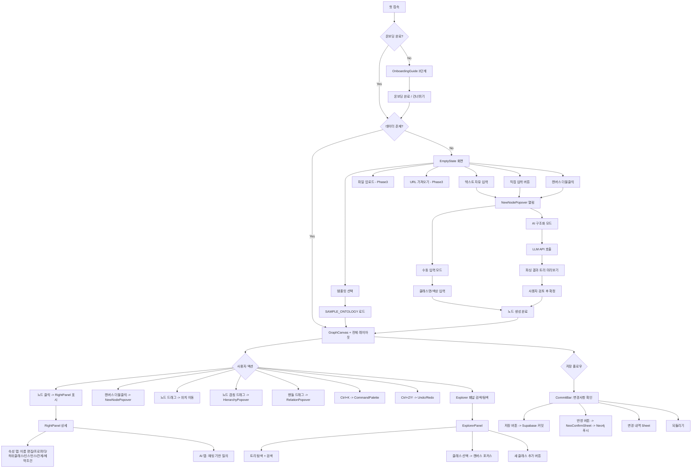
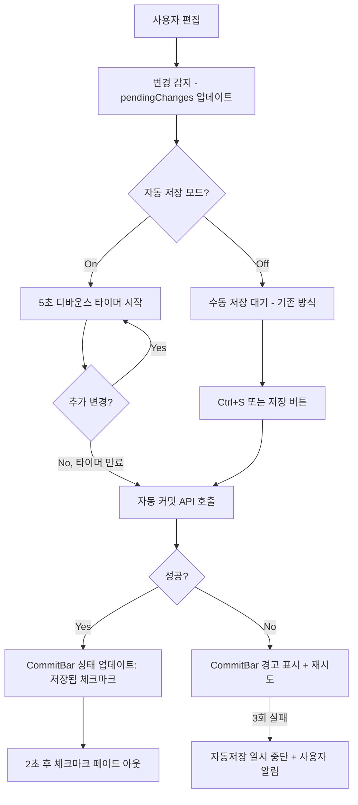
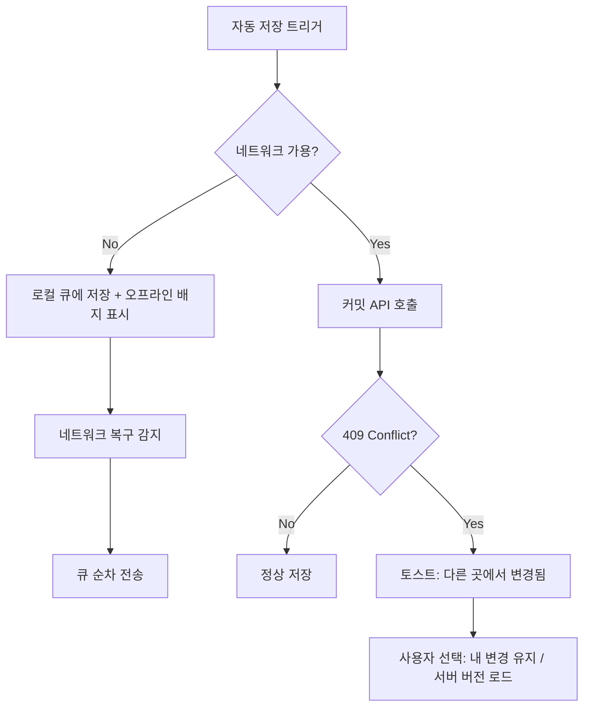
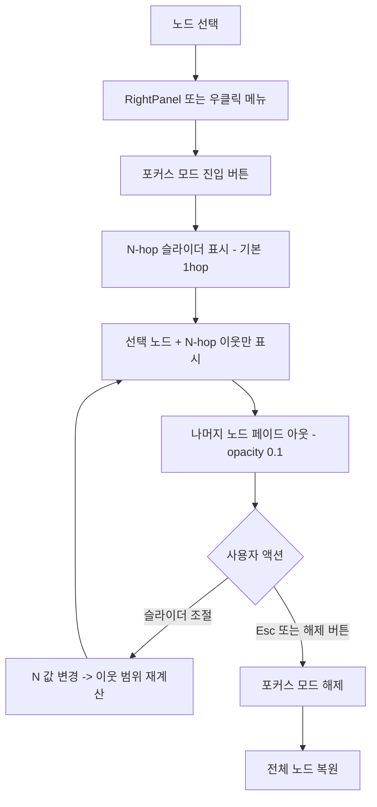
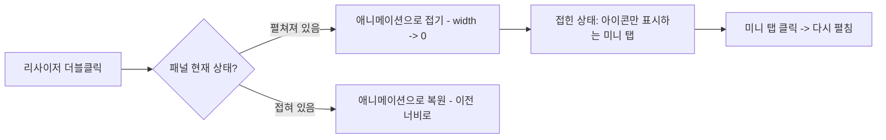
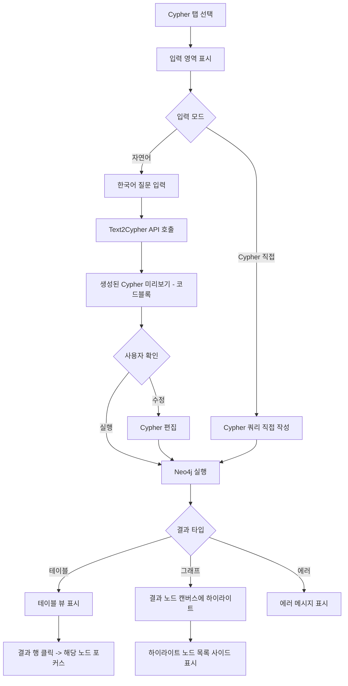
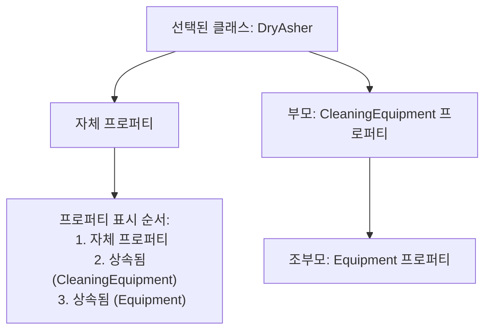
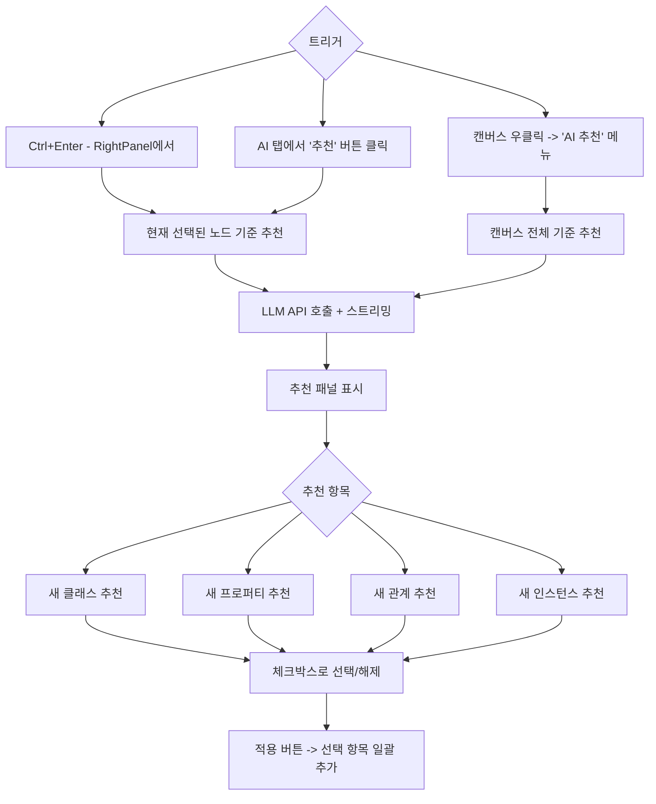
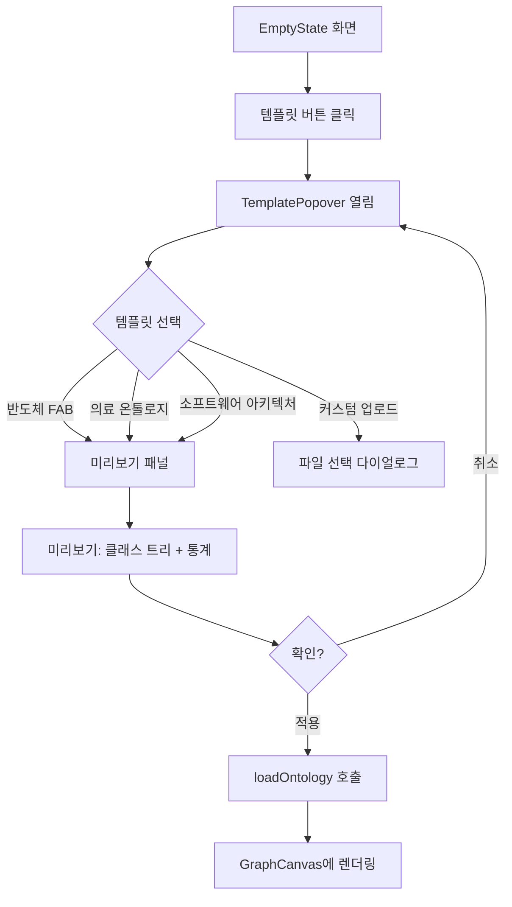
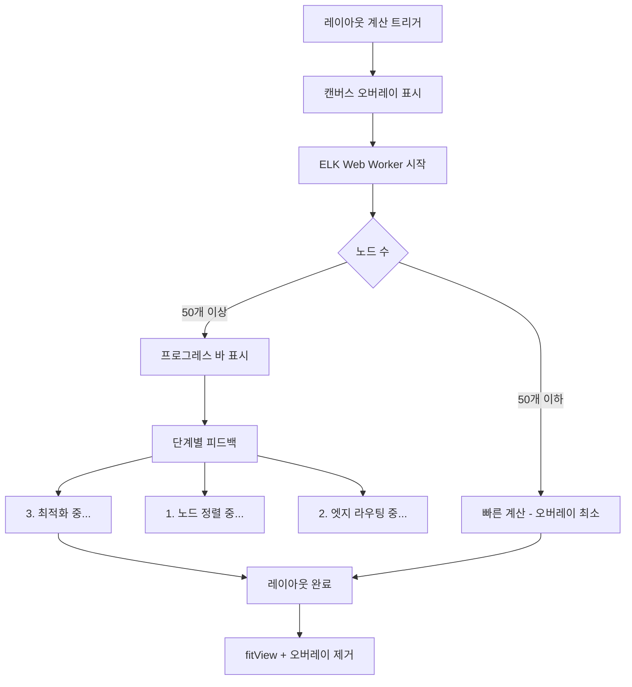

# v4 UX Design Proposal

> Ontology Studio v4 -- 사용자 경험 분석 및 개선안
> 작성일: 2026-03-27

---

## 1. 현재 유저 저니 (As-Is)

### 1.1 전체 유저 플로우



### 1.2 화면 구성 (현재)

```
+----------------------------------------------------------+
|  [ExplorerPanel]  |     [Toolbar]                        |  [RightPanel]
|  w=260px fixed    |  h=46px                              |  w=320px fixed
|                   +--------------------------------------+
|  - 로고            |                                      |  - 속성 탭
|  - 검색            |     [GraphCanvas]                    |    - 이름/설명
|  - 트리뷰          |     React Flow                       |    - 프로퍼티
|  - 인스턴스 카운트   |     + MiniMap                        |    - 하위클래스
|  - 새 클래스 추가    |     + Controls                       |    - 인스턴스
|                   |     + Background(Dots)                |    - 관계
|                   |     + 하단 힌트바(더블클릭/드래그/줌)     |    - 제약조건
|                   +--------------------------------------+  - AI 탭
|                   |     [CommitBar] h=38px                |    - 채팅 UI
+-------------------+--------------------------------------+----+
```

### 1.3 주요 인터랙션 매핑

| 액션 | 트리거 | 결과 |
|------|--------|------|
| 새 노드 생성 | 캔버스 더블클릭 / Ctrl+N / Explorer "새 클래스 추가" / Toolbar "가져오기" | NewNodePopover |
| 노드 선택 | 노드 클릭 / Explorer 항목 클릭 / CommandPalette 선택 | RightPanel 표시 + 캔버스 포커스 |
| 관계 생성 | 핸들 간 드래그 | RelationPopover |
| 계층 설정 | 노드를 다른 노드 위에 드래그(60px 근접) | HierarchyPopover |
| 삭제 | Delete/Backspace 키 | DeleteConfirmDialog |
| 저장 | Ctrl+S / CommitBar "저장" 버튼 | Supabase 커밋 |
| Neo4j 반영 | Ctrl+Enter / CommitBar "반영" 버튼 | NeoConfirmSheet |
| 검색 | Ctrl+K (CommandPalette) / Ctrl+F (Explorer 검색) | 명령 + 노드 검색 |
| Undo/Redo | Ctrl+Z / Ctrl+Shift+Z / Ctrl+Y | temporal store |
| 도구 전환 | V(선택) / H(이동) | 캔버스 인터랙션 모드 변경 |
| 줌 | Toolbar 버튼 / 하단 힌트바 +/- / 마우스 휠 | 캔버스 줌 (Semantic zoom: full/name/dot) |

---

## 2. 페인 포인트 분석

### 2.1 데이터 손실 위험
- **수동 저장만 존재**: 사용자가 Ctrl+S 또는 "저장" 버튼을 누르지 않으면 모든 변경사항이 소실됨
- CommitBar의 `pendingChanges`가 브라우저 탭 종료 시 사라짐
- 피드백이 toast 알림뿐 -- 저장 상태를 상시 확인할 수 없음

### 2.2 탐색 제한
- Explorer에서 필터링은 이름 기준 텍스트 검색만 가능
- 노드 타입별(클래스/인스턴스), 색상별, 관계별 필터 없음
- 대규모 온톨로지에서 특정 부분만 집중 편집할 수 없음
- MiniMap은 있지만 "N-hop 이웃만 보기" 같은 포커스 모드 없음

### 2.3 컨텍스트 메뉴 부재
- 우클릭 시 브라우저 기본 메뉴만 표시
- 노드에서 자주 쓰는 액션(삭제, 관계 추가, 색상 변경 등)에 접근하려면 여러 단계 필요

### 2.4 고정된 패널 크기
- ExplorerPanel 260px, RightPanel 320px -- 고정 너비
- 캔버스 공간이 좁은 노트북 화면에서 비효율적
- 패널을 접거나 크기 조절 불가

### 2.5 Text2Cypher 접근 경로 부재
- Neo4j에 직접 Cypher 쿼리를 실행하려면 외부 도구 사용 필요
- 자연어 -> Cypher 변환 기능이 있지만 UI에서 접근 불가

### 2.6 프로퍼티 상속 불투명
- 하위 클래스가 부모의 프로퍼티를 상속받는지 시각적으로 확인 불가
- RightPanel의 프로퍼티 목록에 "상속됨" 표시 없음

### 2.7 자동 완성/추천 부재
- 온톨로지 확장 시 AI 추천이 별도 채팅 탭에서만 가능
- 인라인 자동 완성 없음

---

## 3. v4 기능별 UX 설계안

### 3.1 D6. 자동 저장

#### 유저 플로우



#### CommitBar 상태 표시 (자동 저장)

```
[ 기존 CommitBar ]
+---------------------------------------------------------------+
| (o) 변경사항 3건  +2 ~1                  [되돌리기] [변경내역] [저장] [반영] |
+---------------------------------------------------------------+

[ 자동 저장 활성: 아이들 상태 ]
+---------------------------------------------------------------+
| (v) 자동 저장됨 14:32:05    [Auto]       [되돌리기] [변경내역]        [반영] |
+---------------------------------------------------------------+

[ 자동 저장 활성: 변경 중 ]
+---------------------------------------------------------------+
| (...) 저장 대기 중...  +1                  [되돌리기] [변경내역]        [반영] |
+---------------------------------------------------------------+

[ 자동 저장 활성: 저장 진행 중 ]
+---------------------------------------------------------------+
| (spin) 저장 중...                          [되돌리기] [변경내역]        [반영] |
+---------------------------------------------------------------+

[ 자동 저장 실패 ]
+---------------------------------------------------------------+
| (!) 저장 실패 - 재시도 중 (2/3)             [되돌리기] [변경내역] [수동저장] [반영] |
+---------------------------------------------------------------+
```

#### 모드 전환 UX

- CommitBar 좌측에 `[Auto]` 토글 배지 추가
- 클릭 시 자동/수동 전환 -- 토글 애니메이션 (pill switch)
- 자동 저장 ON 시 기존 "저장" 버튼은 숨기고 상태 텍스트로 대체
- 자동 저장 OFF 시 기존 방식 그대로 유지
- 설정 값은 `localStorage`에 persist

#### 충돌 시나리오



---

### 3.2 D7. 고급 필터 + 포커스 모드

#### 필터 UI 위치

Toolbar 우측 영역에 "필터" 아이콘 버튼 추가. 클릭 시 드롭다운 패널 열림.

```
Toolbar:
+------------------------------------------------------------------+
| PSK PEE Ontology [v0.1] | [V][H] | [+][-][Fit] | [Undo][Redo] |  ... [Filter] [검증] | [Export][Import][AI] |
+------------------------------------------------------------------+
                                                     ^
                                          클릭 시 드롭다운
```

#### 필터 드롭다운

```
+----------------------------------+
| 필터                         [x] |
+----------------------------------+
| 노드 타입:                        |
|   [x] 클래스  [x] 인스턴스        |
|                                  |
| 색상:                            |
|   (o)(o)(o)(o)(o)(o)  [전체]     |
|                                  |
| 관계:                            |
|   [ ] 관계 있는 노드만            |
|   [ ] 고립 노드만                 |
|                                  |
| 프로퍼티:                         |
|   [프로퍼티명 검색...          ]   |
|   [ ] 해당 프로퍼티가 있는 노드만   |
|                                  |
+--[필터 초기화]---------[적용]-----+
```

#### 포커스 모드



#### 포커스 모드 화면

```
+----------------------------------------------------------+
|  [ExplorerPanel]  |  [Toolbar]                 [포커스: 2-hop]  [x 해제]  |
|                   +---------------------------------------------+
|                   |                                             |
|                   |     (dim) ---- (dim)                        |
|                   |                  |                           |
|                   |     [1-hop] -- [SELECTED] -- [1-hop]        |
|                   |                  |                           |
|                   |     (dim) -- [2-hop] --- [2-hop]            |
|                   |                                             |
|                   +---------------------------------------------+
|                   |  N-hop: [1]====[2]=====[3]  범위 슬라이더     |
+-------------------+---------------------------------------------+
```

- 포커스 모드 진입 시 Toolbar 우측에 인디케이터 표시: `포커스: N-hop [x 해제]`
- 하단 힌트바 위치에 N-hop 슬라이더 오버레이
- dim 처리된 노드는 클릭 불가 (hover tooltip으로 이름만 표시)
- Esc 키로 해제

---

### 3.3 D8. 우클릭 컨텍스트 메뉴

#### 메뉴 항목 구성

**클래스 노드 우클릭:**

```
+----------------------------+
| 이름 변경            F2    |
| 색상 변경            >     |
+----------------------------+
| 관계 추가                  |
| 하위 클래스 추가            |
| 인스턴스 추가               |
+----------------------------+
| 포커스 모드 진입            |
| Explorer에서 보기           |
+----------------------------+
| 삭제               Delete  |
+----------------------------+
```

**인스턴스 노드 우클릭:**

```
+----------------------------+
| 이름 변경            F2    |
+----------------------------+
| 관계 추가                  |
| 부모 클래스로 이동    >     |
+----------------------------+
| 포커스 모드 진입            |
| Explorer에서 보기           |
+----------------------------+
| 삭제               Delete  |
+----------------------------+
```

**캔버스(빈 공간) 우클릭:**

```
+----------------------------+
| 새 클래스 생성        N    |
| 새 인스턴스 생성            |
+----------------------------+
| 레이아웃 정리               |
| 전체 보기            Fit   |
+----------------------------+
| 붙여넣기           Ctrl+V  |
+----------------------------+
```

#### 색상 서브메뉴

```
+----------------------------+
| 색상 변경            >     | --> +-------------------+
+----------------------------+     | (o) Root (기본)    |
                                   | (o) Person         |
                                   | (o) Place          |
                                   | (o) Event          |
                                   | (o) Concept        |
                                   | (o) Process        |
                                   | (o) Artifact       |
                                   +-------------------+
```

#### 기존 인터랙션과의 일관성

| 기존 | 우클릭 대응 | 비고 |
|------|------------|------|
| 더블클릭 -> NewNodePopover | 빈 공간 우클릭 -> "새 클래스 생성" | 동일 결과 |
| 클릭 -> RightPanel 표시 | 우클릭 시 먼저 selectNode 호출 후 메뉴 표시 | 선택 상태 동기화 |
| Delete 키 -> 삭제 확인 | 우클릭 -> "삭제" | 동일한 DeleteConfirmDialog |
| RightPanel 이름 클릭 -> 편집 | 우클릭 -> "이름 변경" -> 인라인 편집 모드 진입 | F2 단축키 추가 |

---

### 3.4 E9. 패널 리사이저

#### 드래그 핸들 위치

Explorer(좌측)와 Canvas 사이, Canvas와 RightPanel(우측) 사이에 각각 리사이저 배치.

```
+--------+|+-----------------------------------+|+----------+
|Explorer|R|          Canvas                   |R|RightPanel|
| 260px  |e|          flex-1                   |e| 320px    |
| (min   |s|                                   |s| (min     |
|  200)  |i|                                   |i|  280)    |
| (max   |z|                                   |z| (max     |
|  400)  |e|                                   |e|  500)    |
|        |r|                                   |r|          |
+--------+|+-----------------------------------+|+----------+
          4px                                  4px
```

#### 시각적 피드백

```
[ 기본 상태 ]
  |  <- 1px border-border, 투명 히트영역 4px
  |

[ 호버 상태 ]
  |  <- 2px border-primary/40, 커서 col-resize
  |

[ 드래그 중 ]
  |  <- 2px border-primary, 캔버스 영역에 반투명 오버레이
  |     드래그 중인 위치에 가이드라인 표시
```

#### 더블클릭 접기/펼치기



#### 접힌 상태 미니 탭

```
+--+                                           +--+
|[]| <- Explorer 접힌 상태 (아이콘 버튼)         |[]| <- RightPanel 접힌 상태
|  |    클릭하면 펼침                            |  |
+--+                                           +--+
```

#### 반응형 제약

| 패널 | 최소 너비 | 최대 너비 | 기본 너비 |
|------|----------|----------|----------|
| ExplorerPanel | 200px | 400px | 260px |
| RightPanel | 280px | 500px | 320px |
| Canvas (center) | 최소 400px 보장 | -- | flex-1 |

- 리사이저를 드래그할 때 Canvas 최소 너비를 침범하면 snap-back
- `localStorage`에 마지막 패널 너비 persist

---

### 3.5 Text2Cypher 패널

#### 패널 위치

RightPanel의 세 번째 탭으로 추가. 기존 "속성" 탭, "AI" 탭 옆에 "Cypher" 탭.

```
RightPanel:
+--[속성]--[AI]--[Cypher]--+
|                          |
|  (탭 내용)                |
|                          |
+--------------------------+
```

이유:
- 별도 패널보다 기존 RightPanel에 통합하는 것이 공간 효율적
- AI 탭과 Cypher 탭은 모두 "질의/분석" 성격이므로 같은 위치가 자연스러움
- 모달은 캔버스 인터랙션을 차단하므로 부적절

#### 입력 -> 실행 -> 결과 플로우



#### Cypher 탭 와이어프레임

```
+----[속성]--[AI]--[Cypher]----+
|                              |
| [자연어 / Cypher 직접] 모드   |
|                              |
| +---------------------------+|
| | 자연어 입력...              ||
| | "반도체 장비와 관련된       ||
| |  모든 엔지니어를 찾아줘"    ||
| +---------------------------+|
| [변환]                        |
|                              |
| 생성된 Cypher:               |
| +---------------------------+|
| | MATCH (e:Engineer)         ||
| |  -[:MANAGES]->(eq:Equip)  ||
| | WHERE eq.domain = 'semi'  ||
| | RETURN e, eq              ||
| +--[편집]----------[실행]---+|
|                              |
| 결과 (3건):                  |
| +---------------------------+|
| | e.name    | eq.name       ||
| |-----------|---------------|
| | 김철수    | SUPRA         ||  <- 클릭 시 캔버스 포커스
| | 이영희    | WetStation    ||
| | 박준호    | DryAsher      ||
| +---------------------------+|
|                              |
| 히스토리:                    |
| +---------------------------+|
| | > 반도체 장비...     14:32 ||
| | > MATCH (n) RETU...  14:28 ||
| +---------------------------+|
+------------------------------+
```

#### 쿼리 히스토리 UX

- 최근 20개 쿼리 `localStorage`에 persist
- 히스토리 항목 클릭 시 쿼리 재로드
- 각 항목에 삭제 버튼 (hover 시 표시)
- 자연어 쿼리와 생성된 Cypher를 함께 저장

---

### 3.6 B4. 프로퍼티 상속 시각화

#### RightPanel에서 상속 프로퍼티 표시

```
RightPanel > 속성 탭 > 프로퍼티 섹션:

+-------------------------------+
| PROPERTIES (5)                |
+-------------------------------+
| -- 자체 프로퍼티 --            |
| name         string    [req]  |
| capacity     integer          |
| status       enum [3]         |
+-------------------------------+
| -- 상속됨 (Equipment) --  [^] |  <- [^] 부모 클래스로 이동
| manufacturer  string          |  <- 연한 색상 + 좌측 세로선
| model_year    integer         |
+-------------------------------+
```

#### 시각적 구분 규칙

| 요소 | 자체 프로퍼티 | 상속 프로퍼티 |
|------|-------------|-------------|
| 텍스트 색상 | `text-foreground` | `text-muted-foreground` |
| 좌측 인디케이터 | 없음 | 2px `border-l border-primary/20` |
| 섹션 구분 | -- | `text-[10px] uppercase` 헤더 + 부모 클래스명 |
| 편집 가능 | Yes | No (부모에서만 편집) |
| 호버 액션 | 편집/삭제 | "부모에서 편집" 링크 |

#### 다중 상속 체인 처리



---

### 3.7 C4. 온톨로지 자동 완성

#### 트리거 방법



#### 추천 UI (RightPanel 인라인)

```
+------------------------------+
| AI 추천               [닫기] |
+------------------------------+
| 현재 "Equipment" 기준 추천:   |
|                              |
| [x] + 하위 클래스:           |
|     MeasurementEquipment     |
|     InspectionEquipment      |
|                              |
| [x] + 프로퍼티:              |
|     serialNumber (string)    |
|     location (string)        |
|                              |
| [ ] + 관계:                  |
|     requires -> Maintenance  |
|                              |
| [x] + 인스턴스:              |
|     SUPRA-001                |
|     WetStation-A2            |
|                              |
+---[모두 선택]------[적용 4건]-+
```

---

### 3.8 C5. 도메인 템플릿

#### EmptyState에서의 템플릿 선택 UX



#### 템플릿 미리보기 개선

현재: 이름 + 설명 텍스트만 표시
개선: 미리보기 카드 확대

```
+--------------------------------------+
| 반도체 FAB 온톨로지        [적용]     |
+--------------------------------------+
|                                      |
|  미리보기 트리:                       |
|  Equipment                           |
|    +-- CleaningEquipment             |
|    |     +-- DryAsher                |
|    |     +-- WetStation              |
|    +-- MeasurementEquipment          |
|  Process                             |
|    +-- CMP                           |
|    +-- Etch                          |
|  Person                              |
|    +-- Engineer                      |
|                                      |
|  클래스 8개 / 인스턴스 12개 / 관계 6개  |
+--------------------------------------+
```

---

### 3.9 A9. ELK Web Worker 레이아웃 피드백

#### 로딩 상태 표시



#### 오버레이 디자인

```
+----------------------------------------------------------+
|                                                          |
|                                                          |
|              +---------------------------+               |
|              |  레이아웃 계산 중...        |               |
|              |  [=====>         ] 42%    |               |
|              |  노드 128개 엣지 라우팅 중  |               |
|              +---------------------------+               |
|                                                          |
|                                                          |
+----------------------------------------------------------+
```

- 50개 이하: 스피너만 0.3초 표시 후 즉시 전환 (flash 방지를 위해 최소 표시 시간 없음)
- 50개 이상: 단계별 텍스트 + 프로그레스 바
- 캔버스 위에 반투명 오버레이 (`bg-background/60 backdrop-blur-sm`)
- 계산 중에도 취소 가능한 "취소" 버튼

---

## 4. v4 이후 전체 레이아웃 (To-Be)

### 4.1 패널 리사이저 + Text2Cypher 통합

```
+----------+|+-----------------------------------+|+------------+
| Explorer |R|           Toolbar                  |R| RightPanel |
| (resize) |e| [V][H] [+][-][Fit] [U][R]         |e| (resize)   |
|          |s| [Filter]  [검증][Export][Import][AI]|s|            |
| min:200  |i+------------------------------------+i| [속성][AI]  |
| max:400  |z|                                    |z| [Cypher]   |
|          |e|        GraphCanvas                 |e|            |
| 트리뷰    |r|        React Flow                  |r| 선택 노드   |
| 검색      | |        + MiniMap                   | | 상세 편집   |
| 새클래스   | |        + Controls                  | |            |
|          | |                                    | | min:280    |
|          | |   [포커스: 2-hop] [x] (조건부)       | | max:500    |
|          | +------------------------------------+ |            |
|          | |  CommitBar [Auto] 변경사항 N건       | |            |
+----------+|+------------------------------------+|+------------+
```

### 4.2 우클릭 메뉴가 포함된 화면

```
+----------+|+-----------------------------------+|+------------+
| Explorer |R|           Toolbar                  |R| RightPanel |
|          |e+------------------------------------+e|            |
|          |s|                                    |s|            |
|          |i|    [ClassNode]                     |i|            |
|          |z|         |                          |z|            |
|          |e|    [ClassNode] ------ [ClassNode]  |e|            |
|          |r|         |     +------------------+ |r|            |
|          | |         |     | 이름 변경      F2 | | |            |
|          | |  [InstanceNode]| 색상 변경      > | | |            |
|          | |               |------------------| | |            |
|          | |               | 관계 추가         | | |            |
|          | |               | 하위 클래스 추가   | | |            |
|          | |               | 인스턴스 추가      | | |            |
|          | |               |------------------| | |            |
|          | |               | 포커스 모드 진입   | | |            |
|          | |               | Explorer에서 보기  | | |            |
|          | |               |------------------| | |            |
|          | |               | 삭제       Delete | | |            |
|          | |               +------------------+ | |            |
+----------+|+------------------------------------+|+------------+
```

### 4.3 포커스 모드 상태

```
+----------+|+-----------------------------------+|+------------+
| Explorer |R|  Toolbar  [포커스: DryAsher 2-hop] [x 해제]      |
|          |e+------------------------------------+e|            |
|          |s|                                    |s|            |
|          |i|  (dim)   (dim)                     |i|            |
|          |z|    |       |                       |z|            |
|          |e| [1-hop]--[SELECTED]--[1-hop]       |e|            |
|          |r|    |       |                       |r|            |
|          | | (dim)   [2-hop]----[2-hop]          | |            |
|          | |                                    | |            |
|          | +------------------------------------+ |            |
|          | | N-hop: [1]==[*2]==[3]    슬라이더   | |            |
|          | | CommitBar ...                       | |            |
+----------+|+------------------------------------+|+------------+
```

---

## 5. 인터랙션 패턴 가이드

### 5.1 신규 인터랙션 패턴

| 패턴 | 대상 | 설명 |
|------|------|------|
| 우클릭 메뉴 | 노드, 캔버스 | 컨텍스트에 맞는 액션 목록 표시 |
| 리사이저 드래그 | 패널 경계 | 패널 너비 조절, 커서 `col-resize` |
| 리사이저 더블클릭 | 패널 경계 | 패널 접기/펼치기 토글 |
| N-hop 슬라이더 | 포커스 모드 하단 | 범위 1-5 hop, 실시간 필터 |
| 자동 저장 토글 | CommitBar [Auto] 배지 | pill switch로 모드 전환 |
| 자동 완성 | Ctrl+Enter / 버튼 | AI 추천 인라인 패널 표시 |
| Text2Cypher | RightPanel Cypher 탭 | 자연어 -> Cypher -> 실행 -> 결과 |

### 5.2 키보드 단축키 (기존 + 신규)

| 단축키 | 기존 | v4 신규 |
|--------|------|--------|
| Ctrl+Z | Undo | -- |
| Ctrl+Shift+Z | Redo | -- |
| Ctrl+Y | Redo | -- |
| Ctrl+N | 새 노드 | -- |
| Ctrl+S | 저장 | 자동 저장 모드에서는 강제 즉시 저장 |
| Ctrl+K | CommandPalette | -- |
| Ctrl+F | Explorer 검색 | -- |
| Ctrl+Enter | Neo4j 푸시 | AI 자동 완성 (RightPanel 포커스 시) |
| Delete | 삭제 | -- |
| V | 선택 도구 | -- |
| H | 이동 도구 | -- |
| F2 | -- | 선택 노드 이름 변경 (신규) |
| Esc | 팝오버 닫기 | 포커스 모드 해제 |
| Ctrl+Shift+F | CommandPalette | 고급 필터 패널 열기 (변경) |

### 5.3 피드백 패턴 통일

| 상황 | 피드백 방식 |
|------|------------|
| 성공 (저장, 삭제 등) | `toast.success` + CommitBar 상태 업데이트 |
| 경고 (검증 경고, 충돌) | `toast.warning` + 인라인 배지 |
| 에러 (네트워크, 유효성) | `toast.error` + 해당 UI 영역 에러 상태 |
| 진행 중 (API 호출) | 해당 버튼 Loader2 스피너 |
| 자동 저장 상태 | CommitBar 아이콘/텍스트 전환 (체크마크/스피너/경고) |
| 레이아웃 계산 | 캔버스 오버레이 + 프로그레스 바 (큰 그래프만) |

---

## 6. 접근성 고려사항

### 6.1 키보드 네비게이션

- 모든 새 UI 요소(우클릭 메뉴, 리사이저, 필터 패널)는 키보드로 접근 가능해야 함
- 우클릭 메뉴: `Shift+F10` 또는 메뉴 키로 열기 / 화살표 키로 탐색 / Enter로 선택 / Esc로 닫기
- 리사이저: 포커스 시 좌우 화살표로 10px 단위 조절 가능
- 포커스 모드 슬라이더: 좌우 화살표로 hop 증감

### 6.2 스크린 리더

- 우클릭 메뉴: `role="menu"` + `role="menuitem"` + `aria-label`
- 자동 저장 상태: `aria-live="polite"`로 상태 변경 알림
- 포커스 모드: 진입/해제 시 `aria-live` 안내
- Text2Cypher 결과 테이블: `role="table"` + 적절한 헤더

### 6.3 색상 대비

- 포커스 모드 dim 처리: `opacity: 0.1` 사용, 색상 변경이 아닌 투명도 처리로 색약 사용자도 구분 가능
- 상속 프로퍼티 구분: 좌측 세로선 + 텍스트 명시 ("상속됨")로 색상에만 의존하지 않음
- 자동 저장 상태 아이콘: 체크마크(v), 경고(!), 스피너 등 형태로도 구분

### 6.4 모션 접근성

- `prefers-reduced-motion` 미디어 쿼리 존중
- 패널 접기/펼치기: reduced-motion 시 즉시 전환 (애니메이션 생략)
- 포커스 모드 전환: reduced-motion 시 페이드 없이 즉시 dim

### 6.5 국제화 (i18n) 고려

- 모든 UI 텍스트는 한국어 UTF-8
- 우클릭 메뉴, 필터 패널 등 신규 텍스트도 한국어 유지
- 향후 다국어 지원 시 텍스트 길이 변동에 대응하는 유동적 레이아웃

---

## 7. 변경 영향 분석

### 7.1 컴포넌트별 변경 범위

| 기능 | 변경 컴포넌트 | 신규 컴포넌트 | 변경 범위 |
|------|-------------|-------------|----------|
| D6 자동 저장 | CommitBar, useApiSync | useAutoSave (hook) | 중간 |
| D7 고급 필터 | Toolbar, GraphCanvas | FilterPanel, FocusMode | 높음 |
| D8 우클릭 메뉴 | GraphCanvas, ClassNode, InstanceNode | ContextMenu | 중간 |
| E9 패널 리사이저 | page.tsx, ExplorerPanel, RightPanel | PanelResizer | 중간 |
| Text2Cypher | RightPanel | CypherTab, CypherEditor | 높음 |
| B4 상속 시각화 | RightPanel (프로퍼티 섹션) | InheritedPropertySection | 낮음 |
| C4 자동 완성 | RightPanel, AIAssistantTab | AutoCompleteSuggestions | 중간 |
| C5 템플릿 | EmptyState | TemplatePreview (확장) | 낮음 |
| A9 ELK 피드백 | GraphCanvas | LayoutOverlay | 낮음 |

### 7.2 Store 변경

- `useOntologyStore`에 추가 필요한 상태:
  - `autoSaveEnabled: boolean`
  - `focusModeNodeId: string | null`
  - `focusModeHops: number`
  - `filterState: FilterState`
  - `panelWidths: { explorer: number; right: number }`
  - `cypherHistory: CypherHistoryEntry[]`
